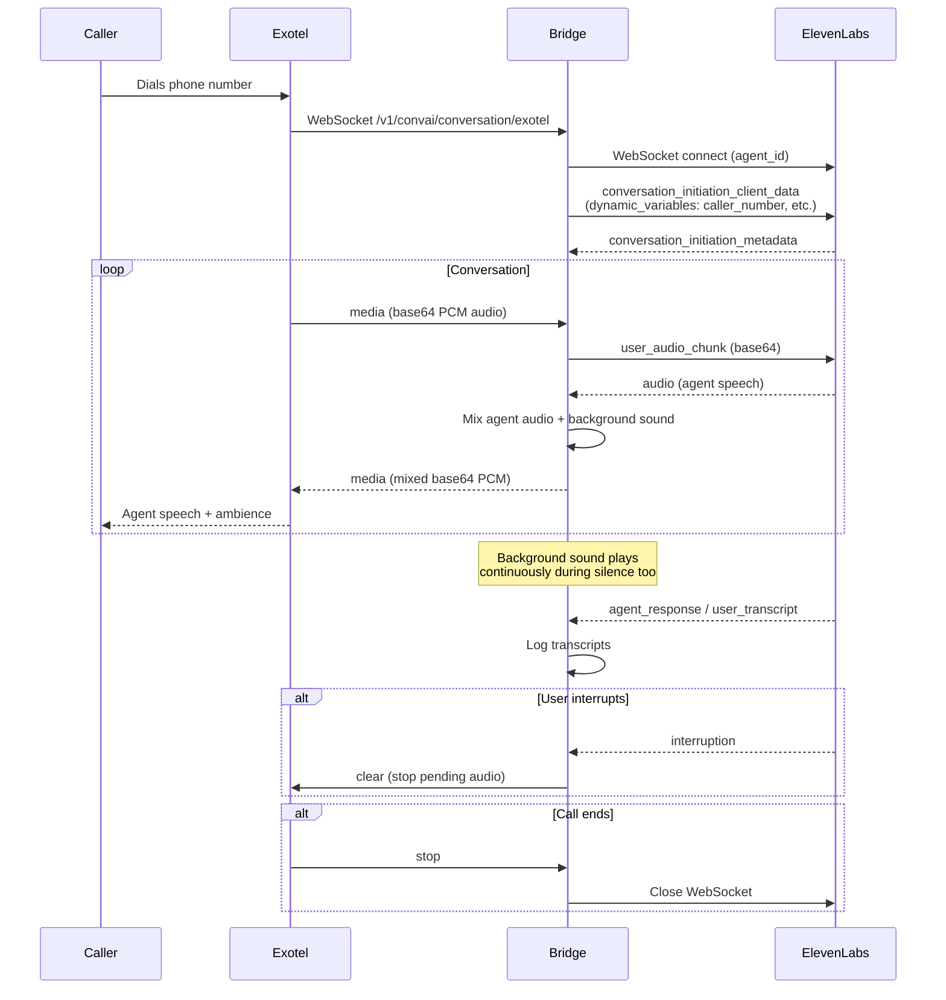
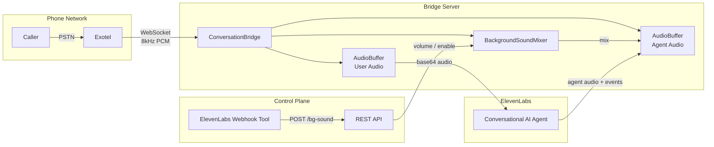

# Exotel <-> ElevenLabs Conversational AI Bridge

A production-ready bridge that connects Exotel's telephony WebSocket streams to ElevenLabs Conversational AI agents, enabling real-time voice conversations over phone calls with background sound mixing.

## Architecture



### Component Overview



## Features

- **Real-time Audio Streaming** -- Bidirectional audio between Exotel and ElevenLabs
- **Background Sound Mixing** -- Loops an ambient sound file, mixed into agent speech and played during silence
- **Live Background Control** -- REST endpoints + ElevenLabs webhook tool to adjust volume or stop background sound mid-call
- **Interruption Support** -- Clears agent audio buffer when user interrupts
- **Dynamic Variables** -- Passes caller number, called number, and custom parameters to the ElevenLabs agent prompt
- **Call Transfer** -- Post-call webhook analysis routes calls to different teams via Exotel Programmable Connect
- **Per-call Logging** -- Structured logs with transcripts, written to stdout (GCP Cloud Logging compatible) and per-call files
- **Cloud Native** -- Dockerfile with gunicorn + gevent for production deployment

## Quick Start

### 1. Install Dependencies

**macOS / Linux:**
```bash
cd exotel
python3 -m venv ../venv
source ../venv/bin/activate
pip install -r requirements.txt
```

**Windows (PowerShell):**
```powershell
cd exotel
python -m venv ..\venv
..\venv\Scripts\Activate.ps1
pip install -r requirements.txt
```

### 2. Prepare Background Sound (optional)

Convert any audio file to the required 8kHz, 16-bit, mono WAV format:

```bash
ffmpeg -i your-ambience.mp3 -af "volume=15,alimiter=limit=0.9" -ar 8000 -ac 1 -sample_fmt s16 exotel/assets/office-ambience-loud.wav
```

> The `volume=15,alimiter` filter amplifies quiet ambient recordings to a usable level without clipping.

### 3. Configure

**macOS / Linux:**
```bash
export ELEVENLABS_AGENT_ID="your_agent_id"
export ELEVENLABS_API_KEY="your_api_key"           # optional but recommended
export ELEVENLABS_REGION="default"                  # default | us | eu | india
export BG_SOUND_FILE="exotel/assets/office-ambience-loud.wav"
export BG_SOUND_VOLUME="0.5"                        # 0.0 to 1.0
```

**Windows (PowerShell):**
```powershell
$env:ELEVENLABS_AGENT_ID = "your_agent_id"
$env:ELEVENLABS_API_KEY = "your_api_key"
$env:ELEVENLABS_REGION = "default"
$env:BG_SOUND_FILE = "exotel\assets\office-ambience-loud.wav"
$env:BG_SOUND_VOLUME = "0.5"
```

### 4. Run

```bash
# Development (macOS/Linux: python3, Windows: python)
python3 exotel/bridge.py --port 10002

# Production - Linux
gunicorn --bind 0.0.0.0:10002 --worker-class gevent --workers 1 --timeout 0 "exotel.bridge:app"

# Production - macOS (requires fork safety override)
OBJC_DISABLE_INITIALIZE_FORK_SAFETY=YES \
  gunicorn --bind 0.0.0.0:10002 --worker-class gevent --workers 1 --timeout 0 "exotel.bridge:app"
```

> **Windows:** gunicorn does not support Windows. Use the development command (`python3 exotel/bridge.py`) or run via Docker.

### 5. Expose with ngrok (for local development)

```bash
ngrok http 10002 --domain your-domain.ngrok-free.dev
```

Configure Exotel Stream applet WebSocket URL to:
`ws://your-domain.ngrok-free.dev/v1/convai/conversation/exotel`

## API Endpoints

| Method | Path | Description |
|--------|------|-------------|
| `GET` | `/health` | Server health + config info |
| `GET` | `/bg-sound` | Background sound status for all active calls |
| `POST` | `/bg-sound` | Control background sound (`{"enabled": bool, "volume": float}`) |
| `GET` | `/transfers` | List pending call transfers (debug) |
| `POST` | `/webhook/post-call` | ElevenLabs post-call transcription webhook |
| `GET` | `/exotel/connect` | Exotel Programmable Connect endpoint for call routing |

### Background Sound Control

```bash
# Check status
curl https://your-domain.ngrok-free.dev/bg-sound

# Set volume to 20%
curl -X POST https://your-domain.ngrok-free.dev/bg-sound \
  -H "Content-Type: application/json" -d '{"volume": 0.2}'

# Stop background sound
curl -X POST https://your-domain.ngrok-free.dev/bg-sound \
  -H "Content-Type: application/json" -d '{"enabled": false}'

# Re-enable
curl -X POST https://your-domain.ngrok-free.dev/bg-sound \
  -H "Content-Type: application/json" -d '{"enabled": true, "volume": 0.5}'
```

### ElevenLabs Webhook Tool Setup

To let the agent control background sound via voice commands, add a **Webhook** tool in your ElevenLabs agent config:

- **Name:** `control_background_sound`
- **Method:** POST
- **URL:** `https://your-domain.ngrok-free.dev/bg-sound`
- **Body parameters:**
  - `enabled` (boolean) -- start/stop background sound
  - `volume` (number) -- 0.0 to 1.0

## Deployment

Exotel requires `wss://` with a **valid CA-signed TLS certificate**. Self-signed
certs and plain `ws://` do not work — Exotel will reject the connection or tear
down the stream immediately.

> **Do not use AWS App Runner.** App Runner's envoy proxy returns HTTP 403 on
> WebSocket upgrade requests — this is a
> [known unsupported feature](https://github.com/aws/apprunner-roadmap/issues/13).

### Option A: EC2 + Docker + Nginx + Let's Encrypt (recommended)

The simplest production setup. Runs the bridge in Docker on an EC2 instance with
nginx handling TLS termination and WebSocket proxying.

**Prerequisites:**
- An EC2 instance (Amazon Linux 2023, `t3.micro` or larger)
- A domain name pointing to the EC2's public IP (A record)
- Security group with ports 22, 80, 443 open

#### Step 1: Install Docker and run the bridge

```bash
# SSH into your EC2 instance
ssh -i your-key.pem ec2-user@<EC2_PUBLIC_IP>

# Install Docker
sudo yum install -y docker
sudo systemctl start docker && sudo systemctl enable docker

# Run the bridge
sudo docker run -d --name exotel-bridge --restart always \
    -p 10002:10002 \
    -e ELEVENLABS_AGENT_ID=your_agent_id \
    -e ELEVENLABS_API_KEY=your_api_key \
    -e ELEVENLABS_REGION=default \
    ghcr.io/jitendra2603/exotel-elevenlabs-bridge:latest

# Verify it's running
curl http://localhost:10002/health
```

> **`ELEVENLABS_REGION`** must match where your agent was created:
> `default` (US), `us`, `eu`, or `india`.
> Using the wrong region causes "The AI agent you are trying to reach does not exist."

#### Step 2: Set up TLS with nginx + Let's Encrypt

```bash
# Install nginx and certbot
sudo yum install -y nginx python3-certbot-nginx

# Start nginx
sudo systemctl start nginx && sudo systemctl enable nginx

# Get a certificate (replace with your domain)
sudo certbot --nginx -d yourdomain.com --non-interactive --agree-tos \
    --email you@example.com --redirect
```

This automatically:
- Obtains a free Let's Encrypt certificate
- Configures nginx as a TLS reverse proxy with WebSocket support
- Sets up auto-renewal via a systemd timer

If certbot's auto-config doesn't set up the WebSocket proxy, create the config manually:

```bash
cat > /etc/nginx/conf.d/exotel-bridge.conf << 'EOF'
server {
    listen 443 ssl;
    server_name yourdomain.com;

    ssl_certificate /etc/letsencrypt/live/yourdomain.com/fullchain.pem;
    ssl_certificate_key /etc/letsencrypt/live/yourdomain.com/privkey.pem;

    location / {
        proxy_pass http://127.0.0.1:10002;
        proxy_http_version 1.1;
        proxy_set_header Upgrade $http_upgrade;
        proxy_set_header Connection "upgrade";
        proxy_set_header Host $host;
        proxy_set_header X-Real-IP $remote_addr;
        proxy_read_timeout 86400;
        proxy_send_timeout 86400;
    }
}
EOF
sudo nginx -t && sudo systemctl reload nginx
```

#### Step 3: Configure Exotel

Set your Exotel Stream applet WebSocket URL to:
```
wss://yourdomain.com/v1/convai/conversation/exotel?agent_id=your_agent_id
```

#### Updating the bridge

```bash
sudo docker pull ghcr.io/jitendra2603/exotel-elevenlabs-bridge:latest
sudo docker stop exotel-bridge && sudo docker rm exotel-bridge
sudo docker run -d --name exotel-bridge --restart always \
    -p 10002:10002 \
    -e ELEVENLABS_AGENT_ID=your_agent_id \
    -e ELEVENLABS_API_KEY=your_api_key \
    -e ELEVENLABS_REGION=default \
    ghcr.io/jitendra2603/exotel-elevenlabs-bridge:latest
```

#### Viewing logs

```bash
sudo docker logs exotel-bridge --tail 50 --follow
```

### Option B: EC2 + Docker + DuckDNS (no custom domain)

If you don't own a domain, use a free [DuckDNS](https://www.duckdns.org) subdomain:

1. Sign up at https://www.duckdns.org (Google/GitHub login)
2. Create a subdomain (e.g. `mybridge`) and point it to your EC2 IP:
   ```bash
   curl "https://www.duckdns.org/update?domains=mybridge&token=YOUR_TOKEN&ip=<EC2_PUBLIC_IP>"
   ```
3. Follow Steps 1-3 from Option A, using `mybridge.duckdns.org` as the domain

> DuckDNS subdomains work with Let's Encrypt / certbot for free TLS certificates.

### Option C: ECS Fargate + ALB + DuckDNS/ACM

For a fully managed container deployment without managing an EC2 instance.
Uses ECS Fargate behind an ALB with TLS via DuckDNS + Let's Encrypt or ACM.

```bash
export ELEVENLABS_AGENT_ID="your_agent_id"
export ELEVENLABS_API_KEY="your_api_key"
export ELEVENLABS_REGION="default"
export AWS_PROFILE="your-aws-profile"

./deploy_aws.sh
```

Then set up TLS (DuckDNS + `acme.sh`, or ACM with a custom domain).
See `deploy_aws.sh` for full details. ALB requires a valid certificate on its
HTTPS listener — the deploy script creates the ALB with HTTP only; you add TLS
after.

If you own a domain, use a free **ACM certificate** (auto-renews):
```bash
aws acm request-certificate --domain-name bridge.yourcompany.com --validation-method DNS
# Complete DNS validation, add HTTPS listener, point CNAME to ALB DNS name.
```

### Option D: ngrok (local development)

```bash
# Run the bridge locally
python3 exotel/bridge.py --agent-id your_agent_id --port 10002

# Expose via ngrok (provides valid TLS automatically)
ngrok http 10002 --domain your-domain.ngrok-free.dev
```

Exotel applet WebSocket URL: `wss://your-domain.ngrok-free.dev/v1/convai/conversation/exotel?agent_id=<your_agent_id>`

### GCP Cloud Run

```bash
export ELEVENLABS_AGENT_ID="your_agent_id"
export ELEVENLABS_API_KEY="your_api_key"
./deploy_gcp.sh
```

## Environment Variables

| Variable | Default | Description |
|----------|---------|-------------|
| `ELEVENLABS_AGENT_ID` | (required) | ElevenLabs Agent ID |
| `ELEVENLABS_API_KEY` | `""` | ElevenLabs API Key |
| `ELEVENLABS_REGION` | `default` | `default`, `us`, `eu`, `india` |
| `BRIDGE_PORT` | `10002` | Server port |
| `CHUNK_SIZE` | `6400` | Audio chunk size in bytes (must be multiple of 320) |
| `BG_SOUND_FILE` | `""` | Path to background sound WAV (8kHz, 16-bit, mono) |
| `BG_SOUND_VOLUME` | `0.3` | Background sound volume (0.0 - 1.0) |
| `LOG_LEVEL` | `INFO` | `DEBUG`, `INFO`, `WARNING`, `ERROR` |
| `TRANSFER_TEAM_1_NUMBER` | `""` | Phone number for team 1 transfers |
| `TRANSFER_TEAM_2_NUMBER` | `""` | Phone number for team 2 transfers |
| `TICKET_SERVICE_URL` | `http://127.0.0.1:8000/...` | URL for forwarding post-call webhooks |
