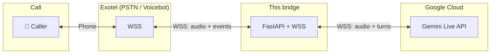

# Exotel ↔ Gemini voice bot bridge

Real-time voice bot: **Exotel** streams call audio to this server; the bridge talks to **Google Gemini Live** and streams AI speech back. No Mongo/Kafka—just a Gemini API key and optional Redis.

---

## Architecture

**Flow:** Caller speaks → Exotel sends PCM over WebSocket → Bridge sends to Gemini → Gemini returns AI audio → Bridge streams back to Exotel → Caller hears bot.

---

## 10-minute run

| Step | Command / action |
|------|------------------|
| **1. Install** | `python3 -m venv venv && source venv/bin/activate` then `pip install -r requirements.txt` |
| **2. Config** | `cp .env.example .env` → edit `.env`: set `GOOGLE_LIVE_WS_API` to your [Gemini API key](https://aistudio.google.com/apikey) (no keys in repo). |
| **3. Run** | `SKIP_FULL_VALIDATION=1 uvicorn main:app --host 0.0.0.0 --port 4040` |
| **4. Check** | Open http://localhost:4040/health → `{"status":"ok"}` |
| **5. Exotel** | Expose with ngrok: `ngrok http 4040`. In Exotel Voicebot Applet set WSS URL to `wss://<ngrok-host>/sales-agent/exotel/ws/audio/<run_id>/<name>?sample-rate=16000` |

**WSS path:** `/sales-agent/exotel/ws/audio/{run_id}/{name}` (optional query: `?sample-rate=16000`).

---

## Repo layout

| What | Where |
|------|--------|
| Exotel ↔ Bridge | `agents/gateway/sales_agent/exotel.py`, `converstation.py` |
| Gemini config | `app/configs/gemini.py` |
| Prompts / voice | `app/configs/prompts.py`, `gemini.py` |
| Env / secrets | `.env` (create from `.env.example`) — **do not commit `.env`** |

---

## Docs

- **Full setup & troubleshooting:** [10_MINUTE_GUIDE.md](10_MINUTE_GUIDE.md)
- **Health:** `GET /health` for load balancers
