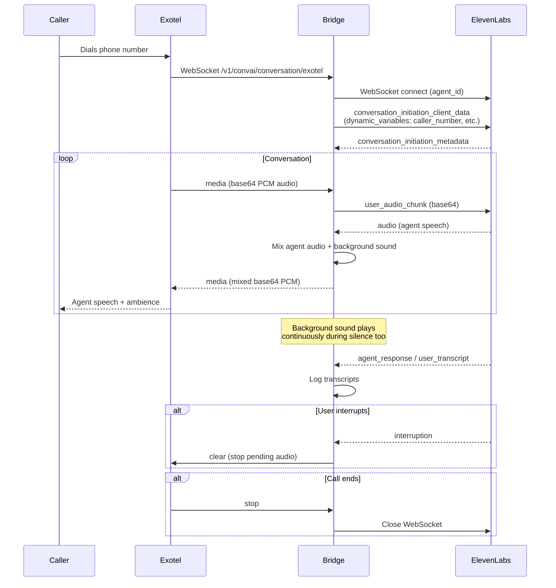
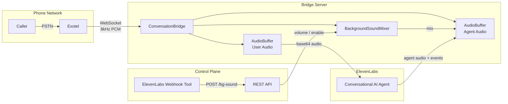

# Exotel <-> ElevenLabs Conversational AI Bridge

A production-ready bridge that connects Exotel's telephony WebSocket streams to ElevenLabs Conversational AI agents, enabling real-time voice conversations over phone calls with background sound mixing.

## Architecture



### Component Overview



## Features

- **Real-time Audio Streaming** -- Bidirectional audio between Exotel and ElevenLabs
- **Background Sound Mixing** -- Loops an ambient sound file, mixed into agent speech and played during silence
- **Live Background Control** -- REST endpoints + ElevenLabs webhook tool to adjust volume or stop background sound mid-call
- **Interruption Support** -- Clears agent audio buffer when user interrupts
- **Dynamic Variables** -- Passes caller number, called number, and custom parameters to the ElevenLabs agent prompt
- **Call Transfer** -- Post-call webhook analysis routes calls to different teams via Exotel Programmable Connect
- **Per-call Logging** -- Structured logs with transcripts, written to stdout (GCP Cloud Logging compatible) and per-call files
- **Cloud Native** -- Dockerfile with gunicorn + gevent for production deployment

## Quick Start

### 1. Install Dependencies

```bash
cd exotel
python3 -m venv ../venv
source ../venv/bin/activate
pip install -r requirements.txt
```

### 2. Prepare Background Sound (optional)

Convert any audio file to the required 8kHz, 16-bit, mono WAV format:

```bash
ffmpeg -i your-ambience.mp3 -af "volume=15,alimiter=limit=0.9" -ar 8000 -ac 1 -sample_fmt s16 exotel/assets/office-ambience-loud.wav
```

> The `volume=15,alimiter` filter amplifies quiet ambient recordings to a usable level without clipping.

### 3. Configure

Set environment variables (or use CLI flags):

```bash
export ELEVENLABS_AGENT_ID="your_agent_id"
export ELEVENLABS_API_KEY="your_api_key"           # optional but recommended
export ELEVENLABS_REGION="default"                  # default | us | eu | india
export BG_SOUND_FILE="exotel/assets/office-ambience-loud.wav"
export BG_SOUND_VOLUME="0.5"                        # 0.0 to 1.0
```

### 4. Run

```bash
# Development
python3 exotel/bridge.py --port 10002

# Production (macOS requires OBJC_DISABLE_INITIALIZE_FORK_SAFETY=YES)
OBJC_DISABLE_INITIALIZE_FORK_SAFETY=YES \
  gunicorn --bind 0.0.0.0:10002 --worker-class gevent --workers 1 --timeout 0 "exotel.bridge:app"
```

### 5. Expose with ngrok (for local development)

```bash
ngrok http 10002 --domain your-domain.ngrok-free.dev
```

Configure Exotel Stream applet WebSocket URL to:
`wss://your-domain.ngrok-free.dev/v1/convai/conversation/exotel`

## API Endpoints

| Method | Path | Description |
|--------|------|-------------|
| `GET` | `/health` | Server health + config info |
| `GET` | `/bg-sound` | Background sound status for all active calls |
| `POST` | `/bg-sound` | Control background sound (`{"enabled": bool, "volume": float}`) |
| `GET` | `/transfers` | List pending call transfers (debug) |
| `POST` | `/webhook/post-call` | ElevenLabs post-call transcription webhook |
| `GET` | `/exotel/connect` | Exotel Programmable Connect endpoint for call routing |

### Background Sound Control

```bash
# Check status
curl https://your-domain.ngrok-free.dev/bg-sound

# Set volume to 20%
curl -X POST https://your-domain.ngrok-free.dev/bg-sound \
  -H "Content-Type: application/json" -d '{"volume": 0.2}'

# Stop background sound
curl -X POST https://your-domain.ngrok-free.dev/bg-sound \
  -H "Content-Type: application/json" -d '{"enabled": false}'

# Re-enable
curl -X POST https://your-domain.ngrok-free.dev/bg-sound \
  -H "Content-Type: application/json" -d '{"enabled": true, "volume": 0.5}'
```

### ElevenLabs Webhook Tool Setup

To let the agent control background sound via voice commands, add a **Webhook** tool in your ElevenLabs agent config:

- **Name:** `control_background_sound`
- **Method:** POST
- **URL:** `https://your-domain.ngrok-free.dev/bg-sound`
- **Body parameters:**
  - `enabled` (boolean) -- start/stop background sound
  - `volume` (number) -- 0.0 to 1.0

## Deployment

### GCP Cloud Run

```bash
export ELEVENLABS_AGENT_ID="your_agent_id"
export ELEVENLABS_API_KEY="your_api_key"
./deploy_gcp.sh
```

### AWS App Runner

```bash
export ELEVENLABS_AGENT_ID="your_agent_id"
export ELEVENLABS_API_KEY="your_api_key"
./deploy_aws.sh
```

### Docker

```bash
docker build -t exotel-elevenlabs-bridge .
docker run -p 10002:10002 \
  -e ELEVENLABS_AGENT_ID=your_agent_id \
  -e BG_SOUND_FILE=exotel/assets/office-ambience-loud.wav \
  -e BG_SOUND_VOLUME=0.5 \
  exotel-elevenlabs-bridge
```

## Environment Variables

| Variable | Default | Description |
|----------|---------|-------------|
| `ELEVENLABS_AGENT_ID` | (required) | ElevenLabs Agent ID |
| `ELEVENLABS_API_KEY` | `""` | ElevenLabs API Key |
| `ELEVENLABS_REGION` | `default` | `default`, `us`, `eu`, `india` |
| `BRIDGE_PORT` | `10002` | Server port |
| `CHUNK_SIZE` | `6400` | Audio chunk size in bytes (must be multiple of 320) |
| `BG_SOUND_FILE` | `""` | Path to background sound WAV (8kHz, 16-bit, mono) |
| `BG_SOUND_VOLUME` | `0.3` | Background sound volume (0.0 - 1.0) |
| `LOG_LEVEL` | `INFO` | `DEBUG`, `INFO`, `WARNING`, `ERROR` |
| `TRANSFER_TEAM_1_NUMBER` | `""` | Phone number for team 1 transfers |
| `TRANSFER_TEAM_2_NUMBER` | `""` | Phone number for team 2 transfers |
| `TICKET_SERVICE_URL` | `http://127.0.0.1:8000/...` | URL for forwarding post-call webhooks |
