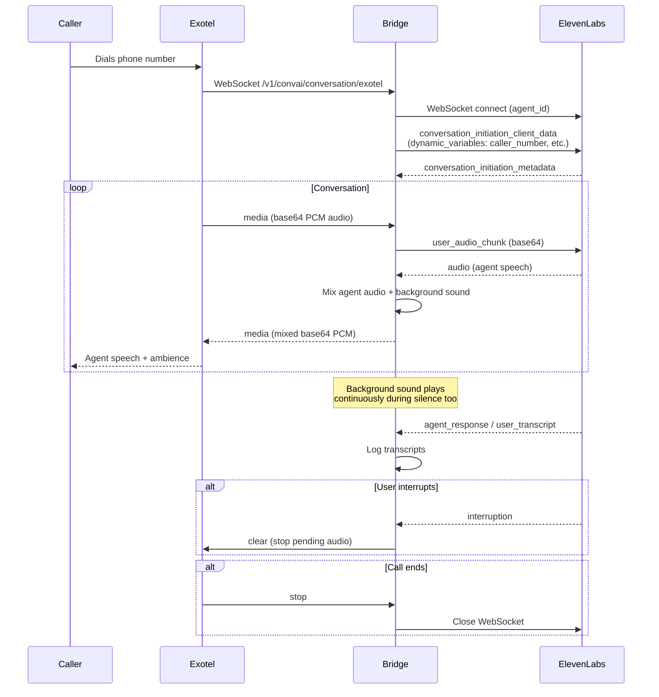
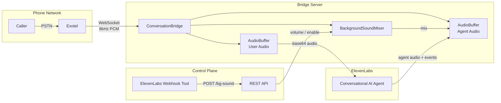

# Exotel <-> ElevenLabs Conversational AI Bridge

A production-ready bridge that connects Exotel's telephony WebSocket streams to ElevenLabs Conversational AI agents, enabling real-time voice conversations over phone calls with background sound mixing.

## Architecture



### Component Overview



## Features

- **Real-time Audio Streaming** -- Bidirectional audio between Exotel and ElevenLabs
- **Background Sound Mixing** -- Loops an ambient sound file, mixed into agent speech and played during silence
- **Live Background Control** -- REST endpoints + ElevenLabs webhook tool to adjust volume or stop background sound mid-call
- **Interruption Support** -- Clears agent audio buffer when user interrupts
- **Dynamic Variables** -- Passes caller number, called number, and custom parameters to the ElevenLabs agent prompt
- **Call Transfer** -- Post-call webhook analysis routes calls to different teams via Exotel Programmable Connect
- **Per-call Logging** -- Structured logs with transcripts, written to stdout (GCP Cloud Logging compatible) and per-call files
- **Cloud Native** -- Dockerfile with gunicorn + gevent for production deployment

## Quick Start

### 1. Install Dependencies

**macOS / Linux:**
```bash
cd exotel
python3 -m venv ../venv
source ../venv/bin/activate
pip install -r requirements.txt
```

**Windows (PowerShell):**
```powershell
cd exotel
python -m venv ..\venv
..\venv\Scripts\Activate.ps1
pip install -r requirements.txt
```

### 2. Prepare Background Sound (optional)

Convert any audio file to the required 8kHz, 16-bit, mono WAV format:

```bash
ffmpeg -i your-ambience.mp3 -af "volume=15,alimiter=limit=0.9" -ar 8000 -ac 1 -sample_fmt s16 exotel/assets/office-ambience-loud.wav
```

> The `volume=15,alimiter` filter amplifies quiet ambient recordings to a usable level without clipping.

### 3. Configure

**macOS / Linux:**
```bash
export ELEVENLABS_AGENT_ID="your_agent_id"
export ELEVENLABS_API_KEY="your_api_key"           # optional but recommended
export ELEVENLABS_REGION="default"                  # default | us | eu | india
export BG_SOUND_FILE="exotel/assets/office-ambience-loud.wav"
export BG_SOUND_VOLUME="0.5"                        # 0.0 to 1.0
```

**Windows (PowerShell):**
```powershell
$env:ELEVENLABS_AGENT_ID = "your_agent_id"
$env:ELEVENLABS_API_KEY = "your_api_key"
$env:ELEVENLABS_REGION = "default"
$env:BG_SOUND_FILE = "exotel\assets\office-ambience-loud.wav"
$env:BG_SOUND_VOLUME = "0.5"
```

### 4. Run

```bash
# Development (macOS/Linux: python3, Windows: python)
python3 exotel/bridge.py --port 10002

# Production - Linux
gunicorn --bind 0.0.0.0:10002 --worker-class gevent --workers 1 --timeout 0 "exotel.bridge:app"

# Production - macOS (requires fork safety override)
OBJC_DISABLE_INITIALIZE_FORK_SAFETY=YES \
  gunicorn --bind 0.0.0.0:10002 --worker-class gevent --workers 1 --timeout 0 "exotel.bridge:app"
```

> **Windows:** gunicorn does not support Windows. Use the development command (`python3 exotel/bridge.py`) or run via Docker.

### 5. Expose with ngrok (for local development)

```bash
ngrok http 10002 --domain your-domain.ngrok-free.dev
```

Configure Exotel Stream applet WebSocket URL to:
`ws://your-domain.ngrok-free.dev/v1/convai/conversation/exotel`

## API Endpoints

| Method | Path | Description |
|--------|------|-------------|
| `GET` | `/health` | Server health + config info |
| `GET` | `/bg-sound` | Background sound status for all active calls |
| `POST` | `/bg-sound` | Control background sound (`{"enabled": bool, "volume": float}`) |
| `GET` | `/transfers` | List pending call transfers (debug) |
| `POST` | `/webhook/post-call` | ElevenLabs post-call transcription webhook |
| `GET` | `/exotel/connect` | Exotel Programmable Connect endpoint for call routing |

### Background Sound Control

```bash
# Check status
curl https://your-domain.ngrok-free.dev/bg-sound

# Set volume to 20%
curl -X POST https://your-domain.ngrok-free.dev/bg-sound \
  -H "Content-Type: application/json" -d '{"volume": 0.2}'

# Stop background sound
curl -X POST https://your-domain.ngrok-free.dev/bg-sound \
  -H "Content-Type: application/json" -d '{"enabled": false}'

# Re-enable
curl -X POST https://your-domain.ngrok-free.dev/bg-sound \
  -H "Content-Type: application/json" -d '{"enabled": true, "volume": 0.5}'
```

### ElevenLabs Webhook Tool Setup

To let the agent control background sound via voice commands, add a **Webhook** tool in your ElevenLabs agent config:

- **Name:** `control_background_sound`
- **Method:** POST
- **URL:** `https://your-domain.ngrok-free.dev/bg-sound`
- **Body parameters:**
  - `enabled` (boolean) -- start/stop background sound
  - `volume` (number) -- 0.0 to 1.0

## Deployment

### AWS (ECS Fargate + ALB + DuckDNS)

The deploy script creates an ECS Fargate service behind an Application Load Balancer
in `ap-south-1` (Mumbai). Exotel requires `wss://` with a valid TLS certificate, so
the setup uses a free [DuckDNS](https://www.duckdns.org) domain with a
[Let's Encrypt](https://letsencrypt.org) certificate on the ALB.

> **Do not use AWS App Runner.** App Runner's envoy proxy returns HTTP 403 on
> WebSocket upgrade requests — this is a
> [known unsupported feature](https://github.com/aws/apprunner-roadmap/issues/13).
> Self-signed certificates also do not work — Exotel rejects them.

**Prerequisites:**
- AWS CLI configured with SSO or access keys
- Docker (with `buildx` for cross-platform builds)
- A free [DuckDNS](https://www.duckdns.org) account (sign in with Google/GitHub)

#### Step 1: Deploy ECS + ALB

```bash
# Configure AWS SSO (one-time)
aws sso login --profile eleven-playground

export ELEVENLABS_AGENT_ID="your_agent_id"
export ELEVENLABS_API_KEY="your_api_key"
export ELEVENLABS_REGION="india"        # default | us | eu | india
export AWS_PROFILE="eleven-playground"  # or your AWS profile name

./deploy_aws.sh
```

> Build with `--platform linux/amd64` on Apple Silicon Macs. Fargate requires x86_64 images.
> The deploy script handles this automatically.

#### Step 2: Set up DuckDNS + TLS

```bash
AWS_PROFILE=eleven-playground
REGION=ap-south-1
DUCKDNS_DOMAIN="mybridge"              # your chosen subdomain
DUCKDNS_TOKEN="your_duckdns_token"     # from https://www.duckdns.org

# 1. Create a subdomain at https://www.duckdns.org (e.g. "mybridge")

# 2. Point it to the ALB IP
ALB_IP=$(dig +short $(aws elbv2 describe-load-balancers --region $REGION --profile $AWS_PROFILE \
    --names exotel-bridge-alb --query "LoadBalancers[0].DNSName" --output text) | head -1)
curl "https://www.duckdns.org/update?domains=${DUCKDNS_DOMAIN}&token=${DUCKDNS_TOKEN}&ip=${ALB_IP}"

# 3. Get a Let's Encrypt certificate
curl https://get.acme.sh | sh
export DuckDNS_Token="$DUCKDNS_TOKEN"
~/.acme.sh/acme.sh --issue --dns dns_duckdns -d ${DUCKDNS_DOMAIN}.duckdns.org \
    --server letsencrypt --dnssleep 30

# 4. Import certificate into ACM
CERT_DIR="$HOME/.acme.sh/${DUCKDNS_DOMAIN}.duckdns.org_ecc"
CERT_ARN=$(aws acm import-certificate --region $REGION --profile $AWS_PROFILE \
    --certificate fileb://${CERT_DIR}/${DUCKDNS_DOMAIN}.duckdns.org.cer \
    --private-key fileb://${CERT_DIR}/${DUCKDNS_DOMAIN}.duckdns.org.key \
    --certificate-chain fileb://${CERT_DIR}/ca.cer \
    --query CertificateArn --output text)

# 5. Add HTTPS listener to ALB
ALB_ARN=$(aws elbv2 describe-load-balancers --region $REGION --profile $AWS_PROFILE \
    --names exotel-bridge-alb --query "LoadBalancers[0].LoadBalancerArn" --output text)
TG_ARN=$(aws elbv2 describe-target-groups --region $REGION --profile $AWS_PROFILE \
    --names exotel-bridge-tg --query "TargetGroups[0].TargetGroupArn" --output text)
aws elbv2 create-listener --region $REGION --profile $AWS_PROFILE \
    --load-balancer-arn "$ALB_ARN" --protocol HTTPS --port 443 \
    --certificates CertificateArn="$CERT_ARN" \
    --default-actions Type=forward,TargetGroupArn="$TG_ARN"
```

Your Exotel applet WebSocket URL:
```
wss://mybridge.duckdns.org/v1/convai/conversation/exotel?agent_id=<your_agent_id>
```

#### Step 3: Update agent ID or env vars

To change the ElevenLabs agent ID or API key after deployment, update the ECS
task definition and redeploy:

```bash
# Edit the environment variables in the task definition JSON, then:
aws ecs register-task-definition --region $REGION --profile $AWS_PROFILE \
    --cli-input-json file://task-definition.json
aws ecs update-service --region $REGION --profile $AWS_PROFILE \
    --cluster exotel-bridge-cluster --service exotel-bridge \
    --task-definition exotel-bridge:<NEW_REVISION> --force-new-deployment
```

#### Certificate renewal

The Let's Encrypt certificate expires every 90 days. Renew and re-import:

```bash
export DuckDNS_Token="$DUCKDNS_TOKEN"
~/.acme.sh/acme.sh --renew -d ${DUCKDNS_DOMAIN}.duckdns.org
aws acm import-certificate --region $REGION --profile $AWS_PROFILE \
    --certificate-arn "$CERT_ARN" \
    --certificate fileb://${CERT_DIR}/${DUCKDNS_DOMAIN}.duckdns.org.cer \
    --private-key fileb://${CERT_DIR}/${DUCKDNS_DOMAIN}.duckdns.org.key \
    --certificate-chain fileb://${CERT_DIR}/ca.cer
```

#### Using a custom domain instead of DuckDNS

If you own a domain (e.g. `bridge.yourcompany.com`), use a free ACM certificate
instead — it auto-renews and supports CNAME (no single-IP limitation):

```bash
CERT_ARN=$(aws acm request-certificate --region $REGION --profile $AWS_PROFILE \
    --domain-name bridge.yourcompany.com --validation-method DNS \
    --query CertificateArn --output text)
# Complete DNS validation in the ACM console, then add the HTTPS listener (step 5 above).
# Point your DNS CNAME to the ALB DNS name.
```

#### Useful commands

```bash
# View logs
aws logs tail /ecs/exotel-bridge --region ap-south-1 --follow --profile eleven-playground

# Check service status
aws ecs describe-services --cluster exotel-bridge-cluster --services exotel-bridge \
  --region ap-south-1 --profile eleven-playground \
  --query 'services[0].{status:status,running:runningCount,desired:desiredCount}'

# Redeploy after code changes
docker buildx build --platform linux/amd64 -t exotel-bridge-repo .
docker tag exotel-bridge-repo:latest <ACCOUNT_ID>.dkr.ecr.ap-south-1.amazonaws.com/exotel-bridge-repo:latest
aws ecr get-login-password --region ap-south-1 --profile eleven-playground | \
  docker login --username AWS --password-stdin <ACCOUNT_ID>.dkr.ecr.ap-south-1.amazonaws.com
docker push <ACCOUNT_ID>.dkr.ecr.ap-south-1.amazonaws.com/exotel-bridge-repo:latest
aws ecs update-service --cluster exotel-bridge-cluster --service exotel-bridge \
  --force-new-deployment --region ap-south-1 --profile eleven-playground

# Update DuckDNS IP (if ALB IPs change)
ALB_IP=$(dig +short <ALB_DNS> | head -1)
curl "https://www.duckdns.org/update?domains=${DUCKDNS_DOMAIN}&token=${DUCKDNS_TOKEN}&ip=${ALB_IP}"
```

### GCP Cloud Run

```bash
export ELEVENLABS_AGENT_ID="your_agent_id"
export ELEVENLABS_API_KEY="your_api_key"
./deploy_gcp.sh
```

### Docker (local)

```bash
docker build -t exotel-elevenlabs-bridge .
docker run -p 10002:10002 \
  -e ELEVENLABS_AGENT_ID=your_agent_id \
  -e ELEVENLABS_API_KEY=your_api_key \
  -e ELEVENLABS_REGION=india \
  -e BG_SOUND_FILE=exotel/assets/office-ambience-loud.wav \
  -e BG_SOUND_VOLUME=0.5 \
  exotel-elevenlabs-bridge
```

### ngrok (local development)

```bash
# Run the bridge locally
python3 exotel/bridge.py --agent-id your_agent_id --port 10002

# Expose via ngrok
ngrok http 10002 --domain your-domain.ngrok-free.dev
```

Exotel applet WebSocket URL: `wss://your-domain.ngrok-free.dev/v1/convai/conversation/exotel?agent_id=<your_agent_id>`

> ngrok provides valid TLS certificates automatically — use `wss://` (not `ws://`).

## Environment Variables

| Variable | Default | Description |
|----------|---------|-------------|
| `ELEVENLABS_AGENT_ID` | (required) | ElevenLabs Agent ID |
| `ELEVENLABS_API_KEY` | `""` | ElevenLabs API Key |
| `ELEVENLABS_REGION` | `default` | `default`, `us`, `eu`, `india` |
| `BRIDGE_PORT` | `10002` | Server port |
| `CHUNK_SIZE` | `6400` | Audio chunk size in bytes (must be multiple of 320) |
| `BG_SOUND_FILE` | `""` | Path to background sound WAV (8kHz, 16-bit, mono) |
| `BG_SOUND_VOLUME` | `0.3` | Background sound volume (0.0 - 1.0) |
| `LOG_LEVEL` | `INFO` | `DEBUG`, `INFO`, `WARNING`, `ERROR` |
| `TRANSFER_TEAM_1_NUMBER` | `""` | Phone number for team 1 transfers |
| `TRANSFER_TEAM_2_NUMBER` | `""` | Phone number for team 2 transfers |
| `TICKET_SERVICE_URL` | `http://127.0.0.1:8000/...` | URL for forwarding post-call webhooks |
