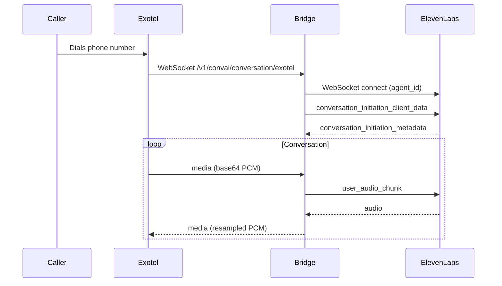

# Exotel ↔ ElevenLabs Conversational AI

Bidirectional AgentStream bridge: Exotel phone audio ↔ ElevenLabs ConvAI agents.

**Catalog path:** `integrations/elevenlabs/`

## Prerequisites

| Item | Notes |
|------|--------|
| Python 3.10+ | venv recommended |
| ElevenLabs | Agent ID + API key ([platform](https://elevenlabs.io)) |
| Exotel | Account SID, API Key, API Token, ExoPhone |
| Public WSS | ngrok or cloudflared (Exotel needs reachable `wss://`) |
| Exotel env | Copy [`shared/env.exotel.example`](../../shared/env.exotel.example) → `shared/.env.exotel` |

**Audio tip:** Prefer agent output format **`pcm_8000`** in ElevenLabs so the bridge skips 16→8 kHz resample (avoids low/“ghost” pitch).

## 3 steps + test call

### Step 1 — Install and configure

```bash
cd integrations/elevenlabs
python3 -m venv venv && source venv/bin/activate
pip install -r exotel/requirements.txt

export ELEVENLABS_AGENT_ID="your_agent_id"
export ELEVENLABS_API_KEY="your_api_key"
export ELEVENLABS_REGION="default"   # default | us | eu | india
export BG_SOUND_VOLUME="0"           # 0 = no ambience for clean tests
```

### Step 2 — Run the bridge

```bash
python exotel/bridge.py --port 10002 --agent-id "$ELEVENLABS_AGENT_ID" --api-key "$ELEVENLABS_API_KEY"
```

Listen: `0.0.0.0:10002`. Path: `/v1/convai/conversation/exotel`.

### Step 3 — Tunnel and place a Connect call

```bash
# Terminal B — public WSS
cloudflared tunnel --url http://127.0.0.1:10002
# or: ngrok http 10002

# Terminal C — from repo root
set -a && source shared/.env.exotel && set +a
python shared/place_connect_call.py \
  --to +91XXXXXXXXXX \
  --stream-url "wss://YOUR_HOST/v1/convai/conversation/exotel"
```

| | |
|--|--|
| **StreamUrl** | `wss://HOST/v1/convai/conversation/exotel` |
| **Port** | `10002` |

### Verify

- Phone answers; agent speaks at normal pitch/speed (not slow/deep).
- Logs: `Resampling enabled…` if EL is 16 kHz; `first_audio_ms=…`.
- Call lasts ≫ 4s (early hangup usually means bad WSS URL or blocked receive loop).

See [Connect Voice AI](../../docs/CONNECT_VOICE_AI.md) and [docs.exotel.com draft](../../docs/exotel-developer/elevenlabs.md).

---

## Architecture



## Features

- Real-time bidirectional PCM with Exotel ↔ ElevenLabs
- Optional background ambience mix
- Interruption (`clear`), dynamic variables, transfer helpers
- Resample when EL negotiates `pcm_16000` and AgentStream is 8 kHz

## Production (AWS)

Exotel requires `wss://` with a valid CA-signed certificate. Do not use AWS App Runner for WebSockets.

### EC2 + Docker + Nginx + Let's Encrypt

**Prerequisites:** EC2 (Amazon Linux 2023), domain A record, SG ports 22/80/443.

#### Step 1: Docker bridge

```bash
cd integrations/elevenlabs
docker build -t exotel-elevenlabs .
docker run -d --name bridge -p 10002:10002 \
  -e ELEVENLABS_AGENT_ID=... -e ELEVENLABS_API_KEY=... \
  exotel-elevenlabs
```

#### Step 2: Nginx + TLS

Terminate TLS on 443; proxy WebSocket upgrades to `127.0.0.1:10002`.

#### Step 3: Exotel StreamUrl

`wss://your.domain/v1/convai/conversation/exotel`

## API endpoints

| Method | Path | Description |
|--------|------|-------------|
| `GET` | `/health` | Health |
| `GET`/`POST` | `/bg-sound` | Background sound control |
| `POST` | `/webhook/post-call` | Post-call webhook |
| `GET` | `/exotel/connect` | Programmable Connect helper |

## Attribution

See [ATTRIBUTION.md](ATTRIBUTION.md).
